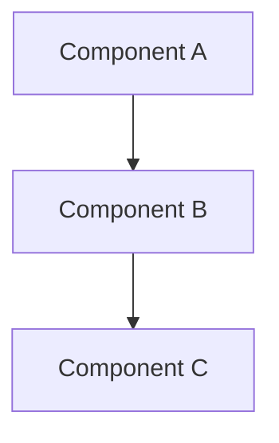

## Architecture Decision
<!-- Clear description of the architectural decision or design work needed -->

## Context & Problem Statement
<!-- What is driving this architectural decision? -->
<!-- What problem are we trying to solve? -->

## Decision Drivers
<!-- What factors are influencing this decision? -->
- 
- 
- 

## Considered Options
<!-- List all options considered -->

### Option 1: [Name]
**Pros**:
- 
- 

**Cons**:
- 
- 

### Option 2: [Name]
**Pros**:
- 
- 

**Cons**:
- 
- 

### Option 3: [Name] (if applicable)
**Pros**:
- 
- 

**Cons**:
- 
- 

## Recommended Decision
<!-- Which option is recommended and why? -->

## Consequences
<!-- What are the positive and negative consequences of this decision? -->

**Positive**:
- 
- 

**Negative**:
- 
- 

**Risks**:
- 
- 

## Dependencies
<!-- List any blocking dependencies -->
<!-- Example: -->
<!-- - Depends on #123 - Need to finalize data model first -->

## Implementation Plan
<!-- High-level plan for implementing this architecture -->

### Phase 1: [Name]
- [ ] Task 1
- [ ] Task 2

### Phase 2: [Name]
- [ ] Task 1
- [ ] Task 2

### Phase 3: [Name]
- [ ] Task 1
- [ ] Task 2

## Test Strategy
<!-- How will we validate this architecture works? -->
- [ ] Proof of concept implementation
- [ ] Performance testing
- [ ] Load testing (if applicable)
- [ ] Security review
- [ ] Integration testing

## Acceptance Criteria
<!-- Checklist for completion -->
- [ ] Architecture document created/updated
- [ ] Design diagrams created (if needed)
- [ ] Technical spike complete (if needed)
- [ ] Proof of concept validated
- [ ] Team review and approval
- [ ] Documentation updated
- [ ] Implementation plan finalized

## Diagrams
<!-- Include or link to architecture diagrams -->
<!-- Use Mermaid, PlantUML, or upload images -->

## Files/Components Affected
<!-- List the components, services, or files that will be affected -->
- 
- 
- 

## Technical Constraints
<!-- List any technical constraints or limitations -->
- 
- 

## Performance Considerations
<!-- Performance implications of this architecture -->

## Security Considerations
<!-- Security implications of this architecture -->

## Scalability Considerations
<!-- How does this architecture scale? -->

## Estimated Effort
**Research Time**: [2-8 hours]  
**Implementation Time**: [4-32 hours]  
**Complexity**: [High/Very High]

## Stakeholders
<!-- Who needs to review/approve this decision? -->
- [ ] Tech Lead
- [ ] Team Architect
- [ ] Product Owner
- [ ] Security Team
- [ ] DevOps Team

## Agent Notes
<!-- Any special instructions for the executing agent -->

## Related Documentation
<!-- Links to relevant documentation, ADRs, RFCs -->
- 
- 

## References
<!-- External references, articles, best practices -->
- 
- 
