# Copilot Agent Personas - Visual Workflow

**Mermaid diagrams showing how Copilot agents coordinate during development**

---

## 🔄 Complete Feature Implementation Workflow


---

## 🎯 Agent Decision Flow

```mermaid
flowchart TD
    Start([User Request]) --> Question{What's the task?}
    
    Question -->|Need information| AnswerAgent[@answer-agent]
    Question -->|Build/implement| CodingAgent[@coding-agent]
    Question -->|Check quality| VerificationAgent[@verification-agent]
    
    AnswerAgent --> SearchPRD[Search PRD.json]
    SearchPRD --> SearchPlans[Search Plans/]
    SearchPlans --> Found{Answer found?}
    Found -->|Yes| ReturnAnswer[Return answer <5s with sources]
    Found -->|No| Escalate[Escalate to Planning Team]
    ReturnAnswer --> End([Done])
    Escalate --> End
    
    CodingAgent --> ReadPRD[Read PRD for specs]
    ReadPRD --> Uncertain{≥5% uncertain?}
    Uncertain -->|Yes| AskQuestion[Call askQuestion MCP tool]
    Uncertain -->|No| Implement[Implement code]
    AskQuestion --> AnswerAgent
    Implement --> WriteTests[Write tests]
    WriteTests --> Report[reportTaskStatus completed]
    Report --> End
    
    VerificationAgent --> Wait[Wait 60s for stability]
    Wait --> RunTests[Run all test suites]
    RunTests --> ComparePlan[Compare to PRD]
    ComparePlan --> Result{All pass?}
    Result -->|Yes| PassResult[reportVerificationResult PASS]
    Result -->|No| FailResult[reportVerificationResult FAIL]
    Result -->|Partial| PartialResult[reportVerificationResult PARTIAL]
    PassResult --> End
    FailResult --> BackToCoding[Send back to @coding-agent]
    PartialResult --> BackToCoding
    BackToCoding --> CodingAgent
```

---

## 🔀 Agent Coordination Patterns

### Pattern 1: Simple Implementation

```mermaid
graph LR
    A[User: @coding-agent implement X] --> B[@coding-agent]
    B --> C[Read PRD]
    C --> D[Implement + Tests]
    D --> E[reportTaskStatus]
    E --> F[Done]
```

### Pattern 2: Implementation with Questions

```mermaid
graph LR
    A[User: @coding-agent implement X] --> B[@coding-agent]
    B --> C[Read PRD]
    C --> D{Uncertain?}
    D -->|Yes| E[@answer-agent via askQuestion]
    E --> F[Get clarification]
    F --> G[Implement + Tests]
    D -->|No| G
    G --> H[Done]
```

### Pattern 3: Full Cycle with Verification

```mermaid
graph TD
    A[User: @coding-agent implement X] --> B[@coding-agent]
    B --> C[Implement + Tests]
    C --> D[User: @verification-agent verify]
    D --> E[@verification-agent]
    E --> F{Result}
    F -->|PASS| G[✅ Done]
    F -->|FAIL| H[Back to @coding-agent]
    H --> I[@coding-agent fix]
    I --> E
```

---

## 🧠 Agent Communication via MCP Tools


---

## 📊 Agent Responsibility Matrix


---

## ⚡ Agent Response Time Comparison


---

## 🎭 Agent Persona Switching


---

## 🔄 Iterative Development Cycle

```mermaid
flowchart TD
    Start([New Feature Request]) --> Q1[@answer-agent: What are requirements?]
    Q1 --> Impl[@coding-agent: Implement]
    Impl --> Verify[@verification-agent: Verify]
    
    Verify --> Check{Result?}
    Check -->|PASS| Done([✅ Complete])
    Check -->|FAIL| Fix[@coding-agent: Fix issues]
    Check -->|PARTIAL| Enhance[@coding-agent: Add missing parts]
    
    Fix --> Verify
    Enhance --> Verify
    
    style Done fill:#90EE90
    style Check fill:#FFD700
    style Fix fill:#FFB6C1
    style Enhance fill:#87CEEB
```

---

## 📋 Agent Priority Handling

```mermaid
flowchart LR
    subgraph "Priority-Aware Agents"
        direction TB
        P1[P1 Task: Critical]
        P2[P2 Task: High]
        P3[P3 Task: Medium]
    end
    
    P1 --> CA1[@coding-agent]
    CA1 --> Strict1[Zero warnings required]
    Strict1 --> VA1[@verification-agent]
    VA1 --> Cov1[90% coverage threshold]
    
    P2 --> CA2[@coding-agent]
    CA2 --> Moderate2[≤5 warnings allowed]
    Moderate2 --> VA2[@verification-agent]
    VA2 --> Cov2[80% coverage threshold]
    
    P3 --> CA3[@coding-agent]
    CA3 --> Lenient3[≤10 warnings allowed]
    Lenient3 --> VA3[@verification-agent]
    VA3 --> Cov3[75% coverage threshold]
    
    style P1 fill:#FF6B6B
    style P2 fill:#FFA500
    style P3 fill:#4ECDC4
```

---

## 🎯 Real-World Example: getNextTask Implementation


---

## 🔍 Agent Internal Workflow Details

### @coding-agent Internal Flow


### @verification-agent Internal Flow

```mermaid
flowchart TD
    Start([Verification requested]) --> Wait[Wait 60s]
    Wait --> Monitor{Files still changing?}
    Monitor -->|Yes| ResetTimer[Reset timer]
    ResetTimer --> Wait
    Monitor -->|No| ExtractReq[Extract requirements from PRD]
    
    ExtractReq --> RunUnit[Run unit tests]
    RunUnit --> RunInt[Run integration tests]
    RunInt --> RunLint[Run linting]
    RunLint --> RunType[Run type checking]
    
    RunType --> CalcCov[Calculate coverage]
    CalcCov --> CheckPriority{Task priority?}
    
    CheckPriority -->|P1| Threshold1{Coverage ≥90%?}
    CheckPriority -->|P2| Threshold2{Coverage ≥80%?}
    CheckPriority -->|P3| Threshold3{Coverage ≥75%?}
    
    Threshold1 -->|No| Fail
    Threshold2 -->|No| Fail
    Threshold3 -->|No| Fail
    
    Threshold1 -->|Yes| MapReq
    Threshold2 -->|Yes| MapReq
    Threshold3 -->|Yes| MapReq
    
    MapReq[Map requirements to code] --> Gaps{Any gaps?}
    Gaps -->|Yes| Partial[Result: PARTIAL]
    Gaps -->|No| Pass[Result: PASS]
    
    Pass --> Report[reportVerificationResult]
    Partial --> Report
    Fail[Result: FAIL] --> Report
    Report --> End([Done])
```



### @answer-agent Internal Flow

```mermaid
flowchart TD
    Start([Question received]) --> Classify{Question complexity?}
    
    Classify -->|Simple| Budget1[Time budget: 3s]
    Classify -->|Moderate| Budget2[Time budget: 8s]
    Classify -->|Complex| Budget3[Time budget: 15s]
    Classify -->|Architectural| Escalate[Immediate escalation]
    
    Budget1 --> Stage1[Search PRD.json]
    Budget2 --> Stage1
    Budget3 --> Stage1
    
    Stage1 --> Found1{Found?}
    Found1 -->|Yes| Confidence{Confidence ≥70%?}
    Found1 -->|No| Stage2[Search Plans/]
    
    Stage2 --> Found2{Found?}
    Found2 -->|Yes| Confidence
    Found2 -->|No| Stage3[Search Code]
    
    Stage3 --> Found3{Found?}
    Found3 -->|Yes| Confidence
    Found3 -->|No| Escalate
    
    Confidence -->|Yes| Format[Format answer with sources]
    Confidence -->|No| Escalate
    
    Format --> Return[Return answer]
    Escalate --> Route[Route to Planning Team]
    
    Return --> End([Done])
    Route --> End
```



---

## 📈 Agent Performance Metrics Dashboard


---

## 🎬 End-to-End Feature Example


---

**Note**: These diagrams are written in Mermaid syntax and will render in:
- GitHub (in .md files)
- VS Code (with Mermaid extension)
- Markdown preview tools

To view, paste the Mermaid code blocks into [Mermaid Live Editor](https://mermaid.live/) or use a Markdown viewer that supports Mermaid.

---

**Version**: 1.0.0  
**Last Updated**: January 24, 2026
