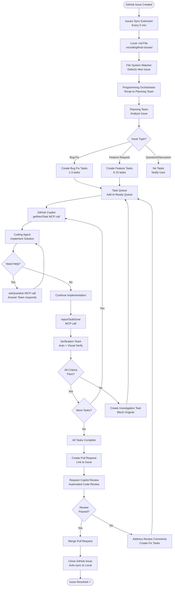
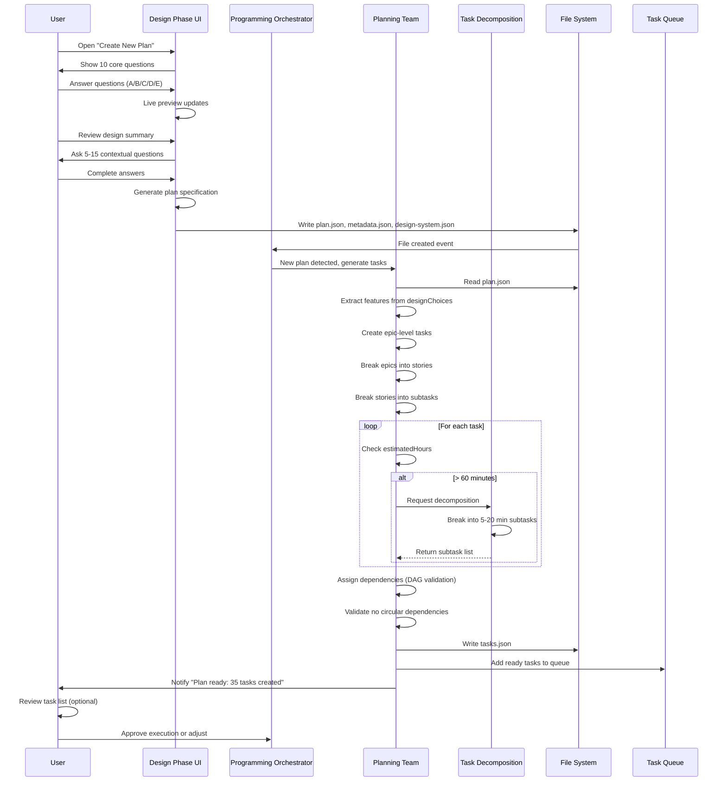
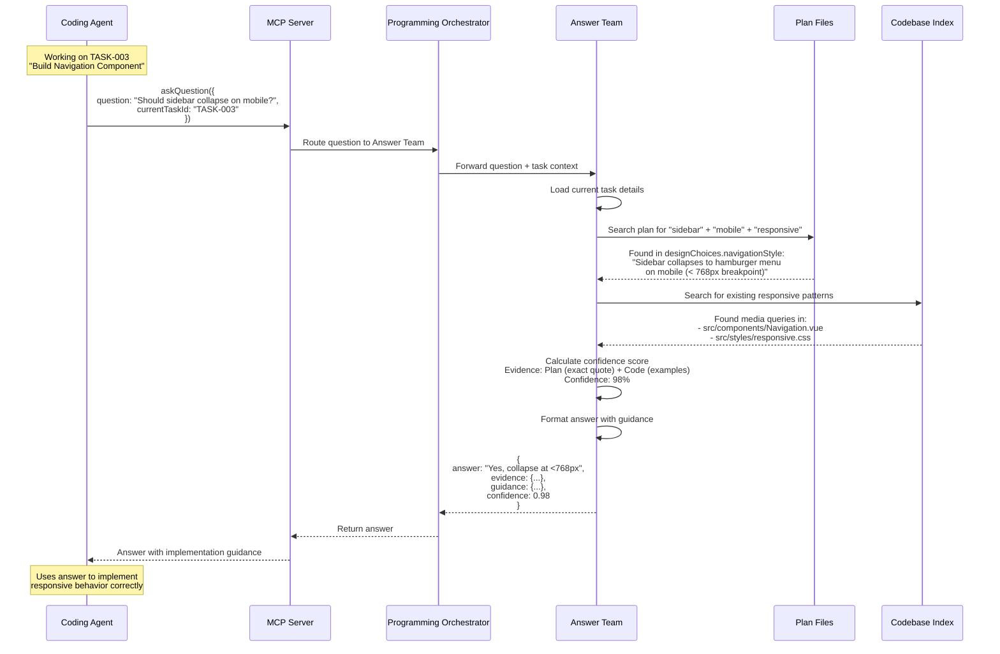
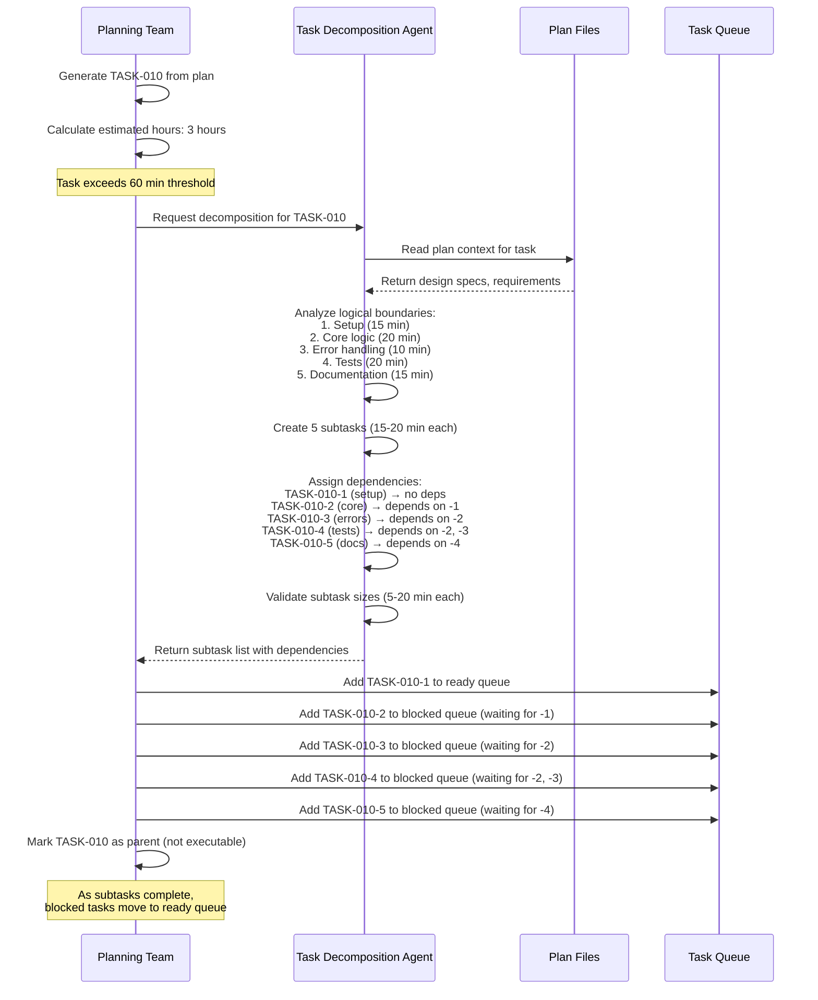
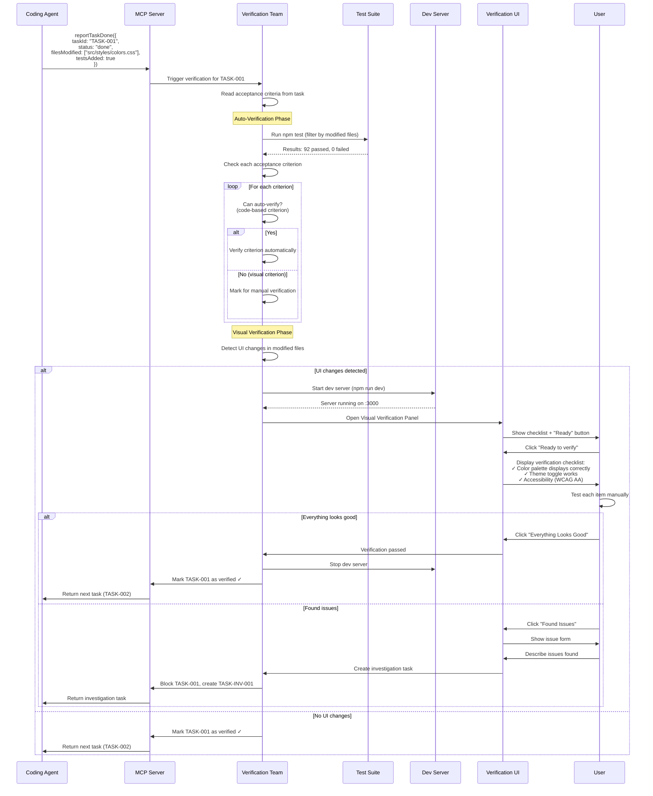
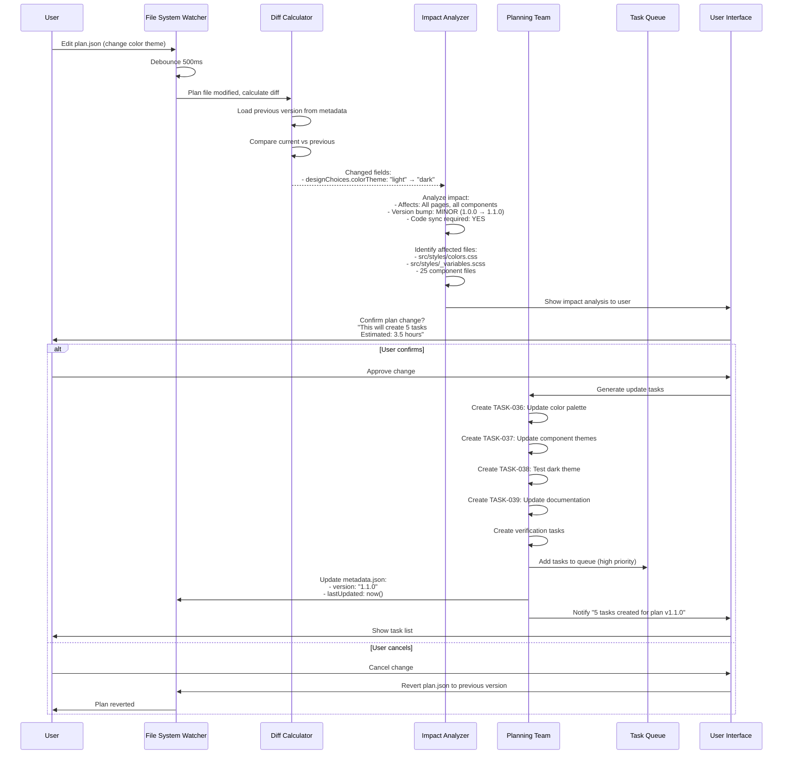
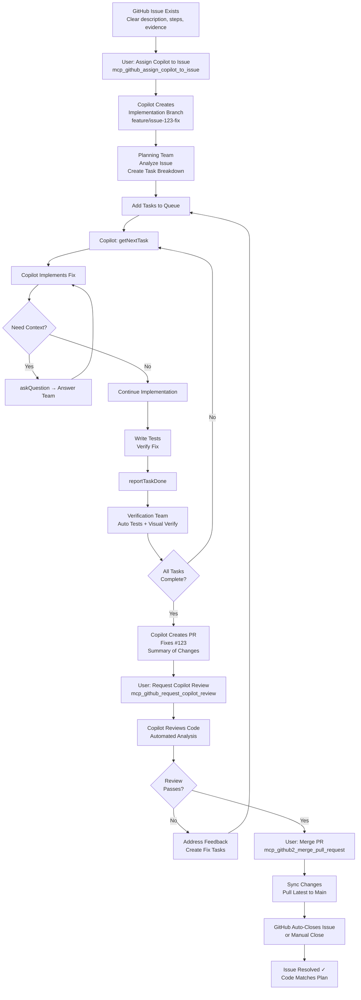
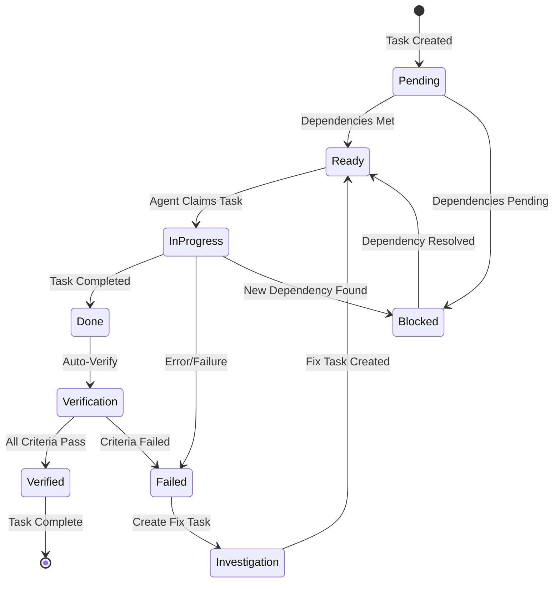

# COE Workflow & Orchestration Document

**Version**: 1.0  
**Date**: January 17, 2026  
**Status**: Draft  
**Cross-References**: [Master Plan](plan.md), [Architecture](01-Architecture-Document.md), [Agent Roles](02-Agent-Role-Definitions.md)

---

## Overview

This document defines the complete orchestration workflows for the Copilot Orchestration Extension, detailing how agents coordinate, how tasks flow through the system, and how the Programming Orchestrator manages the entire process.

---

## Core Orchestration Principles

1. **Plan-Driven Execution**: All tasks originate from plans, not ad-hoc requests
2. **Agent Specialization**: Each agent handles specific responsibilities, no overlap
3. **Dependency Awareness**: Tasks execute in correct order, respecting dependencies
4. **Fail-Safe Handoffs**: Clear handoff protocols with fallback strategies
5. **User Oversight**: Critical decisions require human confirmation

---

## Workflow 1: Complete Issue Resolution Lifecycle



**Duration**: 30 minutes - 4 hours depending on complexity

---

## Workflow 2: Plan Creation to Task Generation



**Duration**: 15-60 minutes (user input) + 5-10 seconds (task generation)

---

## Workflow 3: Question & Answer with Context



**Duration**: 1-5 seconds

---

## Workflow 4: Task Decomposition for Complex Work



**Duration**: 5-10 seconds

---

## Workflow 5: Verification (Auto + Visual)



**Duration**: 20-30 seconds (auto) + 2-10 minutes (visual with user)

---

## Workflow 6: Plan Change → Code Synchronization



**Duration**: 5-10 seconds (impact analysis) + user decision time

---

## Workflow 7: Agent Failure Recovery

```mermaid
flowchart TB
    Start[Agent Receives Task] --> Execute[Agent Executes Task]
    Execute --> Check{Success?}
    
    Check -->|Success| Complete[Report Task Done]
    Check -->|Failure| Detect[Programming Orchestrator<br/>Detects Failure]
    
    Detect --> Type{Failure Type?}
    
    Type -->|Timeout| Retry[Retry with Exponential Backoff<br/>Attempt 1: 5s delay<br/>Attempt 2: 10s delay<br/>Attempt 3: 20s delay]
    
    Retry --> RetryCheck{Retry<br/>Success?}
    RetryCheck -->|Yes| Complete
    RetryCheck -->|No after 3 attempts| Fallback
    
    Type -->|Error| LogError[Log Error Details<br/>Stack Trace, Context]
    LogError --> Fallback[Activate Fallback Strategy]
    
    Type -->|Unresponsive| HealthCheck[Health Check Failed<br/>Agent Not Responding]
    HealthCheck --> Fallback
    
    Fallback --> FallbackType{Fallback<br/>Available?}
    
    FallbackType -->|Alternative Agent| Switch[Switch to Backup Agent<br/>Same Task, Different Agent]
    FallbackType -->|Degrade Gracefully| Manual[Create Manual Task<br/>Notify User for Manual Fix]
    FallbackType -->|Critical Failure| Escalate[Escalate to User<br/>Block Task Queue]
    
    Switch --> Execute
    Manual --> UserNotif[User Notification<br/>"Agent failed, manual action required"]
    Escalate --> UserNotif
    
    UserNotif --> End[Task Blocked<br/>Awaiting User Action]
    Complete --> Success[Task Complete ✓]
```

**Recovery Time**: 5-60 seconds depending on failure type

---

## Workflow 8: Autonomous Issue Fix (Full Cycle)

This is the complete autonomous workflow from the copilot-instructions.md:



**Duration**: 30 minutes - 4 hours for typical issues

---

## Coordination Patterns

### Pattern 1: Sequential Handoff
One agent completes, next agent starts.

**Example**: Planning Team → Task Decomposition → Coding Agent → Verification Team

**Use When**: Tasks have clear dependencies, no parallelization possible

---

### Pattern 2: Parallel Execution
Multiple agents work simultaneously on different tasks.

**Example**: 
- Coding Agent A works on TASK-001
- Coding Agent B works on TASK-005 (no dependency on TASK-001)
- Answer Team responds to questions from both

**Use When**: Tasks are independent, no shared resources

---

### Pattern 3: Broadcast Notify
One event triggers multiple agents.

**Example**: Plan updated → Notify Planning Team, Answer Team, Verification Team

**Use When**: Multiple agents need to react to same event

---

### Pattern 4: Request-Response
Synchronous communication with immediate response.

**Example**: askQuestion → Answer Team responds within 5 seconds

**Use When**: Blocking operation, cannot proceed without answer

---

### Pattern 5: Async Queue
Agent adds work to queue, another agent processes later.

**Example**: Verification Team creates investigation task → Added to queue → Coding Agent picks up later

**Use When**: Non-blocking operation, eventual consistency acceptable

---

## Queue Management

### Task Queue States



### Queue Priority Rules

1. **Critical** - Blockers, security issues, broken builds
2. **High** - Investigation tasks, plan sync tasks, user-reported bugs
3. **Medium** - Feature tasks from plan, refactoring
4. **Low** - Documentation, cleanup, nice-to-have features

---

## Error Scenarios & Recovery

| Scenario | Detection | Recovery | Fallback |
|----------|-----------|----------|----------|
| Agent timeout | Health check (10s interval) | Retry with backoff (3 attempts) | Switch to backup agent or manual task |
| Test failure | Verification Team | Create investigation task, block original | User fixes manually |
| Circular dependency | Planning Team (DAG validation) | Show dependency graph, suggest removal | User resolves manually |
| Plan-code drift | Impact Analyzer | Show diff, create sync tasks | User approves or rejects |
| GitHub API rate limit | API client (track quota) | Queue requests, resume when quota resets | Notify user, pause sync |
| MCP server crash | Extension (process monitor) | Restart server, reload state | Deactivate extension, notify user |

---

## Performance Optimization

### Caching Strategy
- **Plan Files**: Cache in memory, invalidate on file change
- **Task Queue**: In-memory with periodic persistence (every 60s)
- **Code Index**: Build once on activation, incremental updates
- **Answer Team Knowledge**: Cache common questions (LRU cache, max 100 entries)

### Parallelization
- **Multiple Coding Agents**: Up to 4 parallel tasks (independent work)
- **Answer Team**: Can handle multiple questions simultaneously
- **Verification Team**: Auto-verify and visual verify can run in parallel

### Debouncing
- **File System Watcher**: 500ms debounce on plan changes
- **GitHub Sync**: 5 minute interval (configurable)
- **UI Updates**: 200ms debounce on preview updates

---

## Metrics & Monitoring

### Real-Time Metrics
- Tasks in queue (ready, blocked, in-progress, done)
- Agent response times (p50, p95, p99)
- Task completion velocity (tasks/hour)
- Verification pass rate (auto vs manual)
- Plan-code drift score (percentage out of sync)

### Daily Metrics
- Tasks completed (by priority, by type)
- Agent utilization (% time active)
- Average task duration (actual vs estimated)
- Issue resolution time (issue created → closed)
- User intervention rate (manual actions required)

---

## Configuration

### Orchestration Settings (`.vscode/settings.json`)
```json
{
  "coe.orchestration.maxParallelAgents": 4,
  "coe.orchestration.healthCheckInterval": 10000,
  "coe.orchestration.retryAttempts": 3,
  "coe.orchestration.retryBackoff": "exponential",
  "coe.orchestration.taskQueuePersistInterval": 60000,
  "coe.orchestration.autoDecomposeThreshold": 60,
  "coe.orchestration.requireVisualVerifyForUI": true,
  "coe.orchestration.pauseOnPlanConflict": true
}
```

---

## Testing Workflows

### Unit Test Example
```typescript
describe('ProgrammingOrchestrator', () => {
  it('should route task to correct agent', () => {
    const task = { estimatedHours: 2, status: 'pending' };
    const agent = orchestrator.routeTask(task);
    expect(agent).toBe(AgentType.TaskDecomposition);
  });
});
```

### Integration Test Example
```typescript
describe('Complete Issue Resolution', () => {
  it('should resolve issue end-to-end', async () => {
    // Create issue
    const issue = await createTestIssue('Bug: Color contrast');
    
    // Sync to local
    await syncExtension.sync();
    
    // Planning Team generates tasks
    const tasks = await planningTeam.generateTasks(issue);
    expect(tasks).toHaveLength(3);
    
    // Execute tasks
    for (const task of tasks) {
      await codingAgent.execute(task);
      await verificationTeam.verify(task);
    }
    
    // Create PR
    const pr = await github.createPR(issue, tasks);
    expect(pr.state).toBe('open');
    
    // Merge PR
    await github.mergePR(pr);
    
    // Verify issue closed
    const closedIssue = await github.getIssue(issue.number);
    expect(closedIssue.state).toBe('closed');
  });
});
```

---

## References

- [Master Plan](plan.md)
- [Architecture Document](01-Architecture-Document.md)
- [Agent Role Definitions](02-Agent-Role-Definitions.md)
- [copilot-instructions.md](../../../.github/copilot-instructions.md)

**Document Status**: Complete  
**Next Review**: After workflow implementation  
**Owner**: Plan Master Agent + Development Team
