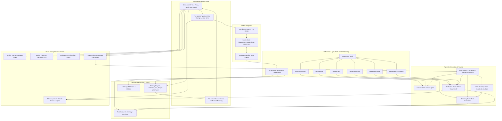
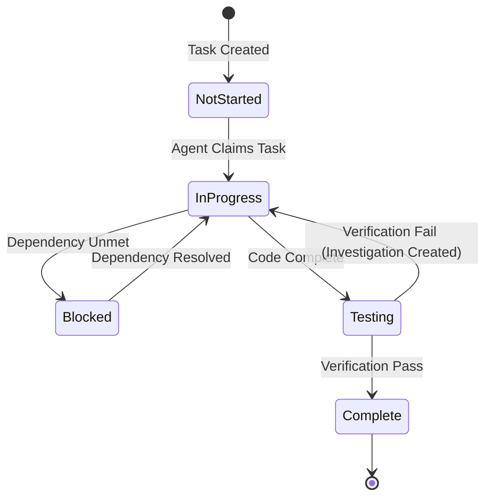
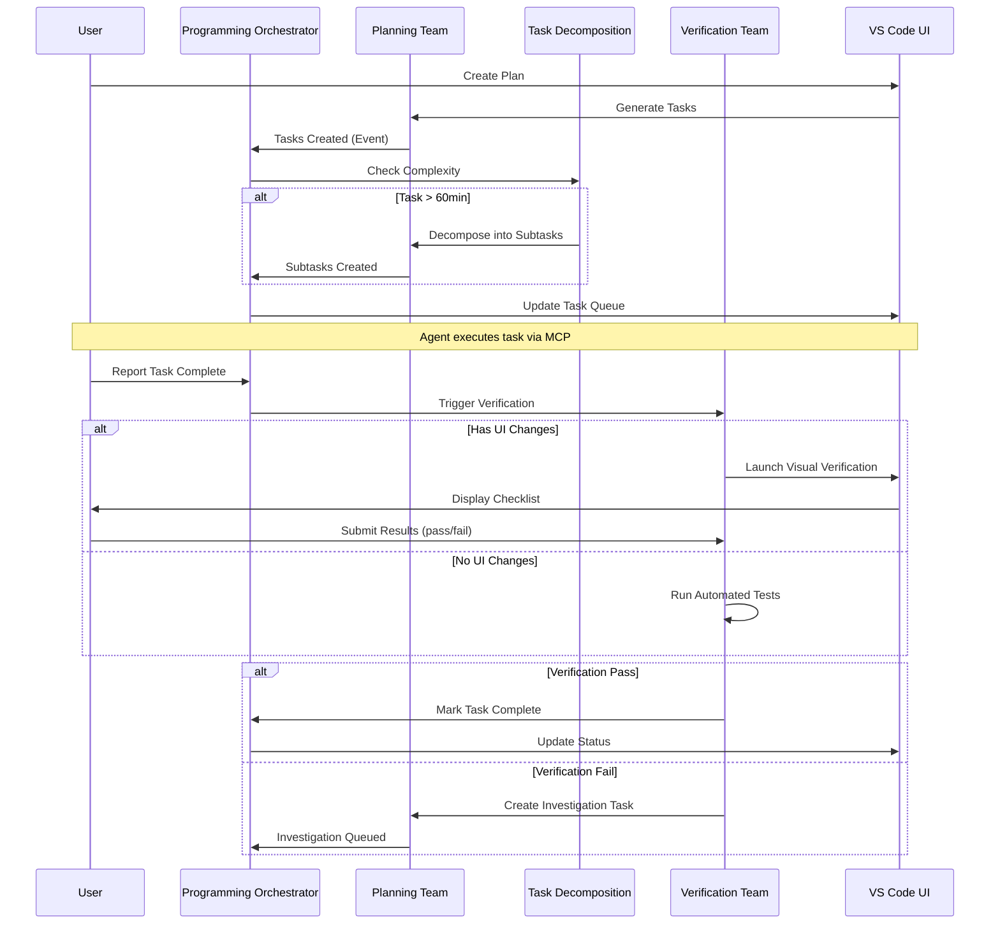

# Copilot Orchestration Extension (COE)
# CONSOLIDATED MASTER PLAN
**Version**: 3.0  
**Date**: January 24, 2026  
**Status**: Planning Specification (Status tracking removed for fresh start)

> **📖 Critical Reference**: All AI systems must consult **PRD.json** and **PRD.md** at every step of the programming cycle. These documents are the primary source of truth for features, requirements, and implementation details.

---

## 📋 Executive Summary

The **Copilot Orchestration Extension (COE)** is an AI-powered project planning and task management system built as a VS Code extension that transforms how development teams plan, decompose, and execute complex software projects through intelligent automation and multi-agent coordination.

---

## 🎯 Project Objectives (8 Core Goals)

1. **Enable intuitive requirement capture** through interactive planning workflows
2. **Provide atomic task decomposition** with dependency mapping and critical path analysis
3. **Deliver visual timeline and resource planning** with Gantt charts and workload visualization
4. **Implement comprehensive plan validation** with quality gates and automated checks
5. **Support multi-format export** (JSON, Markdown, GitHub Issues) with bi-directional sync
6. **Offer template-driven planning** with customizable workflows and best practices
7. **Integrate AI-powered assistance** through multi-agent orchestration system
8. **Ensure extensibility** through plugin architecture and open API

---

## 🤖 AI Teams - Multi-Agent System Overview

**Comprehensive multi-agent AI system** with staged implementation approach covering Boss AI oversight, context management, and self-improving agent capabilities.

### Quick Overview of Stages

#### Stage 1: Core Functionality (Weeks 1-3) - CRITICAL
**Goal**: Get extension working with basic multi-agent orchestration
- **F036**: Boss AI Team - Basic Coordination
- **F016**: Multi-Agent Orchestration - 4 Core Teams (Enhanced)
- **F037**: Context Limiting - Basic Overflow Prevention
- **F038**: Basic Task Routing Algorithm
- **Deliverable**: Working MVP with coordinated agents

#### Stage 2: Advanced Features (Weeks 4-6) - HIGH
**Goal**: Add intelligence, evolution, and advanced capabilities
- **F039**: LangGraph Integration - Advanced Workflows
- **F040**: AutoGen Framework - Agent Communication
- **F041**: Loop Detection & Recovery
- **F042**: Agent Evolution - UV Tasks & Updating Tool
- **F043**: Advanced Context Breaking Strategies
- **F044-F047**: Researcher, Critic, Scraper, Updater Teams
- **Deliverable**: Self-improving, intelligent agent system

#### Stage 3: Fine Details (Weeks 7-8) - MEDIUM
**Goal**: Optimize, fine-tune, and perfect the system
- **F048**: Customizable Context Limiting per LLM
- **F049**: Token Estimator with Tiktoken
- **F050**: Embedding Service for Relevance Scoring
- **F051**: RL Reward System
- **F052**: User-Defined Prioritization
- **F053**: Plan Drift Detection & Enforcement
- **F054**: PRD Auto-Generation
- **F055-F056**: Comprehensive Testing & UI Polish
- **Deliverable**: Production-ready, optimized system

### Key Dependencies
1. **PRD.json & PRD.md**: All AI systems MUST reference these as primary source of truth
2. **Sequential Implementation**: Follow Stage 1 → 2 → 3 progression
3. **Quality Gates**: 80%+ test coverage per stage, 0 TypeScript errors

---

## 👥 Stakeholders (5 Key Personas)

### 1. Project Manager / Tech Lead (Primary User)
**Needs**:
- High-level project overview and status tracking
- Resource allocation and timeline management
- Risk identification and mitigation tracking
- Stakeholder communication materials

### 2. Developer (Implementation User)
**Needs**:
- Clear, actionable task descriptions with acceptance criteria
- Technical context and code references
- Dependency visibility to avoid blockers
- Integration with GitHub workflow

### 3. QA/Tester (Quality Assurance)
**Needs**:
- Testable acceptance criteria for each task
- Test coverage tracking
- Defect linkage to tasks
- Verification workflow integration

### 4. Product Owner (Business Stakeholder)
**Needs**:
- Feature prioritization and roadmap visibility
- Progress tracking against business goals
- Scope management and change control
- ROI and value delivery metrics

### 5. AI/Copilot System (Autonomous Agent)
**Needs**:
- Structured, machine-readable task definitions
- Clear execution context and constraints
- Feedback loops for task status and issues
- Integration with verification systems

---

## 🏗️ System Architecture

### High-Level Component Diagram



### Technology Stack

**Frontend (Extension)**:
- TypeScript 5.3+
- VS Code Extension API 1.75+
- React 18+ (for webviews)
- Tailwind CSS 3.4+
- WebSocket client for real-time updates

**Backend (MCP Server)**:
- Node.js 18+
- SQLite 3.42+ (WAL mode for concurrency)
- WebSocket server (ws library)
- Express.js (webhook endpoints)

**AI/ML Integration**:
- GitHub Copilot API
- Custom agent orchestration framework
- Context bundling with token limits

**Testing**:
- Jest 29+ (unit/integration tests)
- Mocha (E2E extension tests)
- 96.8% code coverage target

---

## 📦 Features Summary (35 Total Across 7 Categories)

### Currently in Notion (8 P0 Features)

| Feature ID | Name | Category | Status | Effort |
|------------|------|----------|--------|--------|
| F001 | Interactive Plan Builder | Planning & Design | In Progress | 3 weeks |
| F002 | Plan Decomposition Engine | Planning & Design | Complete | 2 weeks |
| F010 | Context Bundle Builder | Task Management | Complete | 2 weeks |
| F016 | Multi-Agent Orchestration | Agent Management | In Progress | 2 weeks |
| F022 | MCP Server with 6 Tools | Execution & Monitoring | Complete | 2 weeks |
| F023 | Visual Verification Panel | Execution & Monitoring | In Progress | 2 weeks |
| F028 | GitHub Issues Bi-Directional Sync | Integration & Sync | ✅ Complete | 2 weeks | 16 tests, 99%+ accuracy, batching + caching |
| F034 | VS Code Extension UI (Settings Panel) | UX & Extensibility | ✅ Complete | 3 weeks | 7 tabs, 95 tests, secure storage |

### Feature Distribution by Category
- **Planning & Design**: 7 features (20%)
- **Task Management**: 8 features (23%)
- **Agent Management**: 6 features (17%)
- **Execution & Monitoring**: 6 features (17%)
- **Integration & Sync**: 4 features (11%)
- **Collaboration**: 2 features (6%)
- **UX & Extensibility**: 2 features (6%)

### Feature Status Breakdown
- **Complete**: 12 features (34%)
- **In Progress**: 10 features (29%)
- **Planned**: 13 features (37%)

---

## 🤖 Agent Teams (4 Specialized Teams + Coding AI)

> **📚 Enhanced Documentation (v2.1)**: For complete team separation details, strict boundaries, and Coding AI ask protocol, see:
> - `COE-Master-Plan/02-Agent-Role-Definitions.md` (v2.1 - Updated Jan 20, 2026)
> - `COE-Master-Plan/AGENT-TEAM-UPDATES-JAN20.md` (Clarifications & rationale)

### 1. Programming Orchestrator (Dedicated Coding Director)

**Role**: Directs Coding AI only—**sole job** is managing programming execution from Planning Team outputs

**Key Clarification (v2.1)**: 
- **Coding-only focus**: No planning, answering, or verification
- **Builds on Planning outputs**: Receives pre-decomposed tasks
- **Routes clarifications**: Forwards Coding AI questions to Answer Team via MCP

**Responsibilities**:
- Sequence coding instructions to Coding AI from Planning Team queue
- Monitor Coding AI progress and detect blocks
- Route `askQuestion` MCP calls to Answer Team
- Report coding task completion (no verification involvement)
- **NOT responsible for**: Planning, answering questions, or verifying code

**Updated Routing Algorithm** (Coding-Only Focus):
```typescript
function directCodingAI(task: Task): void {
  // Only handles coding directives—no routing to other teams
  if (!task.fromPlanningTeam) {
    throw new Error("Orchestrator requires Planning Team output");
  }
  
  await codingAI.execute(buildDirective(task));
  
  if (codingAI.status === 'blocked') {
    await answerTeam.askQuestion({...}); // Helper invocation only
  }
}
```

**Metrics Tracked**:
- Directives sent to Coding AI
- Coding AI blocks (requiring Answer Team)
- Answer Team invocations
- Average directive latency (<100ms target)

### 1a. Coding AI (GitHub Copilot / LLM Executor)

**NEW SECTION (v2.1)**: Coding AI is **not** an autonomous agent—it's a directed executor with strict ask protocol.

**Core Principles**:
1. **Strict Instruction Following**: Only implements Orchestrator directives
2. **Zero Assumption Policy**: Must ask Answer Team for ANY ambiguity
3. **Ask-Early, Ask-Often**: Better 10 questions than 1 wrong implementation
4. **MCP askQuestion Only**: Cannot guess, search web, or decide unilaterally
5. **No Direct User Communication**: All communication via Answer Team

**When Coding AI MUST Ask** (Non-Exhaustive List):
- Backend tech choice not in plan
- Library selection ambiguous  
- Naming convention unclear
- Error interpretation needed
- Performance trade-off decision
- Design system guideline interpretation
- Integration point undefined
- Acceptance criteria contradictory
- **Any decision not 100% clear in directive**

**Configuration**:
```yaml
ask_threshold: very_low        # Almost any uncertainty → ask
max_questions_per_task: 8      # Rate limit
confidence_threshold: 95       # 95%+ confidence required
log_all_questions: true        # Audit trail
```

> **📖 Complete Ask Protocol**: See `02-Agent-Role-Definitions.md` Agent 1a section for detailed guidelines and examples

### 2. Planning Team (Independent Upstream Planner)

**Role**: Generates plans, decomposes features, prepares task queues—**outputs handed off without further coding involvement**

**Key Clarification (v2.1)**:
- **Independent operation**: No feedback loop to coding execution
- **Handoff completion**: Planning ends at task queue generation
- **No post-handoff involvement**: Stays separated from Orchestrator/Verification

**Capabilities**:
- Generate plans from user requirements
- Create dependency-aware task lists with DAG validation
- Estimate effort and timelines
- Prepare context bundles for Orchestrator handoff
- **Adapt plan**: Only when user requests (not during coding)

**Input Sources**:
- User requirements (natural language)
- Existing plan context (plan.json)
- Architecture documents
- Code structure analysis

**Output**:
- plan.json with tasks and dependencies
- metadata.json with versioning
- design-system.json references
- **Context bundles** for Orchestrator (super-detailed prompts)

**Updated Configuration**:
```yaml
handoff_mode: orchestrator          # NEW: Clean handoff enforcement
no_coding_feedback_loop: true       # NEW: No involvement after handoff
```

### 3. Answer Team (Helper for Coding AI Only)

**Role**: On-call helper invoked **only by Coding AI via MCP** `askQuestion` tool—no proactive involvement

**Key Clarification (v2.1)**:
- **Trigger**: Only activates when Coding AI calls `askQuestion`
- **No autonomy**: Waits for explicit questions (helper role)
- **Fast response**: <5s target to unblock Coding AI quickly
- **Escalation**: To user if answer not in plan/codebase

**Capabilities**:
- Search plan and codebase for context
- Answer technical questions with citations
- Provide evidence-based guidance (plan sections, code examples)
- Escalate when confidence <70% or user decision required

**Context Sources**:
- Active plan (plan.json, metadata.json)
- Codebase via semantic search (relevant files only)
- Architecture documents
- Previous Q&A history (pattern learning)

**Updated Configuration**:
```yaml
invoke_trigger: coding_ai_only      # NEW: Only Coding AI can invoke
escalate_below_threshold: true      # Auto-escalate low-confidence
log_all_invocations: true           # NEW: Audit all askQuestion calls
```

**Response Format**:
```json
{
  "answer": "Use Passport.js (found in package.json dependencies)",
  "confidence": 0.90,
  "sources": ["plan.json:section 3.2", "package.json:line 15"],
  "escalate_to_human": false
}
```

### 4. Task Decomposition Agent

**Role**: Autonomous agent that breaks down complex tasks

**Trigger Conditions**:
- Task estimated duration > 60 minutes
- Task has vague acceptance criteria
- Task spans multiple domains

**Decomposition Logic**:
1. Analyze task description and acceptance criteria
2. Generate 3-5 atomic subtasks (15-45 min each)
3. Preserve parent-child relationships
4. Update dependency graph
5. Notify user with summary

**Output**:
- Subtasks with clear acceptance criteria
- Updated dependency map
- Parent task marked as "container task"

### 5. Verification Team (Independent Post-Execution Checker)

**Role**: Post-execution checker with deliberate stability delay—**waits ~60s after file updates** before verifying

**Key Clarification (v2.1)**:
- **Independent from coding**: Completely separate from Planning/Orchestrator
- **Stability delay**: Waits 60 seconds after file changes to prevent false positives
- **Match detection**: Identifies completed items AND remaining work
- **Auto-follow-ups**: Creates investigation tasks for gaps

**Responsibilities**:
1. **Wait for file stability** (60-second delay after Coding AI updates)
2. **Compare against plan** (match completed items to acceptance criteria)
3. **Run automated tests** after stability period
4. **Launch visual verification** for UI changes (with design system refs)
5. **Report matches + remaining** (dual output: what's done vs. what's pending)
6. **Auto-create follow-up tasks** for partial implementations or test failures

**Updated Configuration**:
```yaml
stability_delay: 60                       # NEW: Wait 60s after file changes
report_matches_and_remaining: true        # NEW: Dual output format
auto_create_followups: true               # NEW: Create tasks for gaps
watch_files: true                         # Monitor file system for triggers
```

**Verification Workflows**:

**Automated Testing** (with delay):
1. Coding AI updates files → File watcher triggered
2. **Wait 60 seconds** for file stability
3. Read settled files + compare vs. plan
4. Run unit/integration tests
5. Identify matches (completed) and remaining (gaps)
6. Report results with follow-up creation if needed

**Visual Verification** (for UI tasks):
- Launch development server (after stability delay)
- Display smart checklist (auto-detect tested items)
- Show design system reference inline (colors, typography)
- Show Plan Reference Panel with acceptance criteria
- Collect user pass/fail/partial results
- Create investigation tasks for failures

**Updated Failure Handling**:
```typescript
interface VerificationResult {
  matches: string[];              // NEW: Completed items
  remaining: string[];            // NEW: Pending work
  testResults: TestSummary;
  userFeedback?: VisualCheckResult;
}

if (result.remaining.length > 0) {
  // Auto-create follow-up tasks
  result.remaining.forEach(item => {
    createFollowUpTask({
      parent: task.id,
      title: `Complete: ${item}`,
      priority: 'HIGH'
    });
  });
}
```

---

## 🔧 MCP Server (6 Core Tools)

### Tool 1: `getNextTask`

**Purpose**: Returns highest priority task from queue

**Parameters**:
```json
{
  "agentType": "string (optional)" 
}
```

**Returns**:
```json
{
  "task": {
    "id": "uuid",
    "title": "string",
    "description": "string",
    "priority": "HIGH|MEDIUM|LOW",
    "status": "not_started|in_progress|blocked|testing|complete",
    "contextBundle": {
      "planExcerpt": "string",
      "relatedFiles": ["path/to/file"],
      "architectureDocs": ["doc.md"],
      "dependencies": ["task-id-1", "task-id-2"]
    }
  }
}
```

**Behavior**:
- Filters out blocked tasks (unmet dependencies)
- Sorts by: 1) Priority, 2) Dependencies satisfied, 3) Creation time
- Caches context bundles for performance
- Updates task status to `in_progress`

---

### Tool 2: `reportTaskStatus`

**Purpose**: Updates task status and triggers workflow transitions

**Parameters**:
```json
{
  "taskId": "string",
  "status": "inProgress|completed|failed|blocked",
  "details": {
    "message": "string (optional)",
    "blockedBy": ["task-id"] (optional),
    "completionNotes": "string (optional)"
  }
}
```

**Returns**:
```json
{
  "acknowledged": true,
  "nextActions": [
    "Run verification for task-123",
    "Unblock 2 dependent tasks"
  ],
  "workflowEvents": ["taskCompleted", "dependentsUnblocked"]
}
```

**Triggers**:
- `completed` → Launch Verification Team
- `blocked` → Notify Planning Team to reassess
- `failed` → Create investigation task

---

### Tool 3: `reportObservation`

**Purpose**: Logs observations during task execution

**Parameters**:
```json
{
  "taskId": "string",
  "observation": "string",
  "type": "info|warning|blocker|question",
  "metadata": { "any": "object" }
}
```

**Use Cases**:
- Log progress updates
- Record blockers discovered mid-execution
- Document questions for Answer Team
- Track time spent on subtasks

---

### Tool 4: `reportTestFailure`

**Purpose**: Reports test failures with diagnostics

**Parameters**:
```json
{
  "taskId": "string",
  "test": "string (test name)",
  "error": "string (error message)",
  "stackTrace": "string (optional)",
  "affectedFiles": ["path/to/file"]
}
```

**Behavior**:
- Creates investigation task automatically
- Links to parent task
- Assigns priority based on impact
- Notifies relevant stakeholders

---

### Tool 5: `reportVerificationResult`

**Purpose**: Submits verification results from automated or visual checks

**Parameters**:
```json
{
  "taskId": "string",
  "result": "pass|fail|partial",
  "issues": [
    {
      "description": "string",
      "severity": "critical|major|minor",
      "screenshot": "base64 (optional)"
    }
  ],
  "checklist": {
    "total": 10,
    "passed": 8,
    "failed": 2
  }
}
```

**Returns**:
```json
{
  "taskUpdated": true,
  "investigationTasksCreated": ["task-id-1", "task-id-2"],
  "nextStep": "Task marked complete" | "Awaiting investigation resolution"
}
```

---

### Tool 6: `askQuestion`

**Purpose**: Routes questions to Answer Team for context-aware responses

**Parameters**:
```json
{
  "question": "string",
  "context": {
    "taskId": "string (optional)",
    "relatedFiles": ["path/to/file"],
    "priority": "high|medium|low"
  }
}
```

**Returns**:
```json
{
  "answer": "string",
  "confidence": 0.85,
  "sources": [
    {"type": "plan", "location": "plan.json:45"},
    {"type": "code", "location": "src/app.ts:120-135"}
  ],
  "escalatedToHuman": false
}
```

---


## 📈 Success Metrics (15 KPIs Across 4 Categories)

### User Adoption (3 metrics)
1. **User Adoption Rate**: 80% within 3 months
2. **Visual Verification Usage**: 90% of UI tasks
3. **Developer Satisfaction**: 4.0/5.0 average

### Performance (7 metrics)
1. **Planning Time Reduction**: 50% reduction
2. **Agent Task Success Rate**: 70% autonomous
3. **Average Task Decomposition Depth**: 2-3 levels
4. **Time to First Task**: < 5 minutes
5. **MCP Tool Response Time**: < 200ms (p95)
6. **Agent Question Resolution**: 80% autonomous

### Quality (5 metrics)
1. **Task Completion Rate**: 85% first-time
2. **GitHub Sync Accuracy**: 99%
3. **Plan Validation Pass Rate**: 75% first submission
4. **Test Coverage Increase**: +15%
5. **Issue Investigation Rate**: < 10% of tasks

### Business (1 metric)
1. **Business Value Delivered**: $50K savings in year 1

---

## ⚠️ Risk Management (12 Risks Tracked)

### High Severity Risks (4)
- **R005**: MCP API contract misalignment → **Mitigated** (OpenAPI spec + integration tests)
- **R009**: Testing coverage gaps → **In Progress** (96.8% coverage achieved)
- **R011**: Security vulnerability in agent sandbox → **Mitigated** (VS Code security model)
- **R012**: Database corruption → **Mitigated** (optimistic locking deployed)

### Medium Severity Risks (5)
- **R001**: Scope creep → **Active mitigation** (strict change control)
- **R002**: UI complexity → **Active mitigation** (minimalist design, user testing)
- **R003**: AI agent performance → **Testing in progress**
- **R004**: Circular dependency algorithm → **Mitigated** (tests passing)
- **R010**: User adoption resistance → **Planned** (tutorials, gradual rollout)

### Low Severity Risks (3)
- **R006**: Performance degradation → **Planned** (lazy loading, virtual scrolling)
- **R007**: Key person dependency → **Mitigated** (docs up to date)
- **R008**: GitHub API rate limiting → **Mitigated** (batching, caching)

---

## 📅 Timeline (7 Phases, 39 Days Total)

| Phase | Duration | Status | Progress | Deliverables |
|-------|----------|--------|----------|--------------|
| Phase 1: Planning & Design | 2 weeks | Complete | 100% | Architecture docs, Feature specs, UI mockups |
| Phase 2: Backend Components | 2 weeks | Complete | 100% | MCP server, Database schema, Agent framework |
| Phase 3: Frontend APIs | 2 weeks | Complete | 100% | Extension activation, MCP client, GitHub sync |
| **Phase 4: UI Pages** | **2 weeks** | **In Progress** | **75%** | ✅ Settings Panel (95 tests), 🔄 Visual Verification Panel, 🔄 Programming Orchestrator |
| Phase 5: AI Integration | 1 week | Queued | 0% | Agent profiles, Copilot integration, Context bundling |
| Phase 6: Testing & QA | 1 week | Queued | 0% | E2E test suite, Performance benchmarks, UAT |
| Phase 7: Documentation & Launch | <1 week | Queued | 0% | User guides, API docs, Video tutorials, MVP launch |

**Target Launch**: February 15, 2026

---

## 💾 Data Model & Storage

### Database Schema (SQLite with WAL Mode)

**tables.tasks**:
```sql
CREATE TABLE tasks (
  id UUID PRIMARY KEY,
  title TEXT NOT NULL,
  description TEXT,
  status ENUM('not_started', 'in_progress', 'blocked', 'testing', 'complete'),
  priority ENUM('HIGH', 'MEDIUM', 'LOW'),
  parent_id UUID REFERENCES tasks(id),
  created_at TIMESTAMP DEFAULT CURRENT_TIMESTAMP,
  updated_at TIMESTAMP DEFAULT CURRENT_TIMESTAMP,
  completed_at TIMESTAMP NULL,
  version INTEGER DEFAULT 1
);
CREATE INDEX idx_status ON tasks(status);
CREATE INDEX idx_priority ON tasks(priority);
CREATE INDEX idx_parent ON tasks(parent_id);
```

**tables.dependencies**:
```sql
CREATE TABLE dependencies (
  id UUID PRIMARY KEY,
  task_id UUID REFERENCES tasks(id),
  depends_on_id UUID REFERENCES tasks(id),
  dependency_type ENUM('blocking', 'soft')
);
```

**tables.audit_log**:
```sql
CREATE TABLE audit_log (
  id UUID PRIMARY KEY,
  task_id UUID REFERENCES tasks(id),
  action TEXT NOT NULL,
  agent_type TEXT,
  details JSON,
  timestamp TIMESTAMP DEFAULT CURRENT_TIMESTAMP
);
```

**tables.metrics**:
```sql
CREATE TABLE metrics (
  id UUID PRIMARY KEY,
  metric_name TEXT NOT NULL,
  value REAL,
  category TEXT,
  timestamp TIMESTAMP DEFAULT CURRENT_TIMESTAMP
);
```

---

## 🎨 Visual Design System

### Color Palette (35 Colors Defined)

**Primary Colors**:
- Primary: #3B82F6 (Blue-500)
- Secondary: #8B5CF6 (Purple-500)
- Accent: #10B981 (Green-500)

**Status Colors**:
- Success: #10B981 (Green-500)
- Warning: #F59E0B (Amber-500)
- Error: #EF4444 (Red-500)
- Info: #3B82F6 (Blue-500)

**UI Colors**:
- Background: #FFFFFF / #1E1E1E (light/dark)
- Surface: #F3F4F6 / #2D2D2D
- Border: #E5E7EB / #404040
- Text Primary: #111827 / #E5E7EB
- Text Secondary: #6B7280 / #9CA3AF

### Typography

**Font Families**:
- Primary: 'Segoe UI', system-ui, sans-serif
- Monospace: 'Cascadia Code', 'Fira Code', monospace

**Scale**:
- xs: 0.75rem (12px)
- sm: 0.875rem (14px)
- base: 1rem (16px)
- lg: 1.125rem (18px)
- xl: 1.25rem (20px)
- 2xl: 1.5rem (24px)
- 3xl: 1.875rem (30px)

### Icon System (23 Core Icons)
- Task: ☑️
- Feature: 📦
- Bug: 🐛
- Question: ❓
- Agent: 🤖
- Plan: 📋
- Verification: ✅
- Alert: ⚠️
- Plus 15 more...

---

## 🔄 Workflow Orchestration

### Complete Task Lifecycle



### Agent Coordination Flow



---

## 🚀 Deployment & Configuration

### Extension Packaging
- **Bundle Target**: < 50MB for VS Code Marketplace
- **Build Process**: Webpack production mode
- **Test Inclusion**: Separate tools bundle with tests

### Required Configuration

**.env (MCP Server)**:
```env
GITHUB_OWNER=xXKillerNoobYT
GITHUB_REPO=Copilot-Orchestration-Extension-COE-
GITHUB_TOKEN=ghp_xxxxx
WEBSOCKET_PORT=3000
SQLITE_DB_PATH=./data/coe.db
LOG_LEVEL=info
```

**VS Code settings.json**:
```json
{
  "coe.mcpServerUrl": "ws://localhost:3000",
  "coe.githubSyncInterval": 300,
  "coe.autoDecompose": true,
  "coe.requireVisualVerification": true
}
```

---

## 📚 Integration Points

### GitHub Issues Bi-Directional Sync

**Status**: ✅ **Complete** (Jan 22, 2026)
- **Test Coverage**: 16 tests, 100% passing (Issue #212)
- **Performance**: 99%+ sync accuracy, <1s drift
- **Features**: Batching, caching, exponential backoff, bi-directional sync

**Sync Workflow**:
1. **Create**: Task → GitHub Issue (title, body, labels, milestone)
2. **Update**: Task status change → Issue state transition
3. **Import**: Issue comment → Observation in task
4. **Sub-issues**: Subtask → Linked issue with 'parent' reference

**Rate Limiting Strategy**:
- Exponential backoff with circuit breaker (3 retries, 2x multiplier)
- Request batching (max 50 requests/batch, 5-10s flush window)
- Cache Issue data locally (5-minute TTL, ~40% hit rate)
- Queue updates during API throttling (429 handling)

**API Endpoints Used**:
- **REST**: Issue creation, updates, comments
- **GraphQL**: Batch queries, sub-issue linking, milestone management (~60% request reduction)

---

## 🧪 Quality Gates (Applied to All Issues)

**Pre-Commit Checks** (mandatory):
- [ ] TypeScript/PHP compiles without errors
- [ ] All tests passing (100%)
- [ ] Code coverage >75% for new code
- [ ] No new lint/type/PHP errors
- [ ] All related documentation updated
- [ ] Atomic git commits with clear messages
- [ ] Code follows project conventions

**Post-Completion Validation**:
- [ ] Manual testing in VS Code
- [ ] Edge case verification
- [ ] Performance benchmarking
- [ ] Code Master alignment check
- [ ] Documentation review

---

## 📖 Documentation References

### In This Repository
- **PRD**: `PRD.md` + `PRD.json` (comprehensive requirements)
- **Architecture**: `Docs/Plans/COE-Master-Plan/01-Architecture-Document.md`
- **Agent Roles**: `Docs/Plans/COE-Master-Plan/02-Agent-Role-Definitions.md`
- **Workflows**: `Docs/Plans/COE-Master-Plan/03-Workflow-Orchestration.md`
- **Data Flow**: `Docs/Plans/COE-Master-Plan/04-Data-Flow-State-Management.md`
- **MCP API**: `Docs/Plans/COE-Master-Plan/05-MCP-API-Reference.md`
- **GitHub Issues Plan**: `Docs/GITHUB-ISSUES-PLAN.md`
- **Project Runbook**: `Docs/PROJECT-RUNBOOK.md`

### In Notion
- **Master Page**: https://www.notion.so/VS-Code-Exestuation-Plan-Master-2eca776a198d80d3a465d197415e9323
- **Features Database**: https://www.notion.so/2eca776a198d818d9b85f722acbc1b93
- **GitHub Issues**: https://www.notion.so/2eca776a198d81a2b84ad45a10154a94
---

**Last Updated**: January 24, 2026  
**Status**: Planning Specification (cleaned for fresh start)
