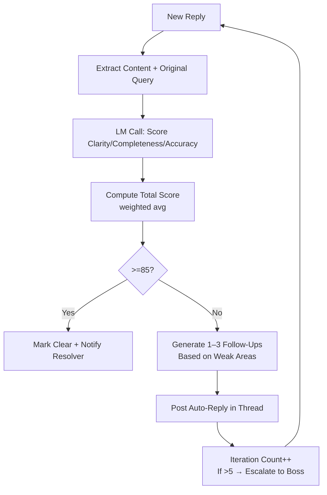

# Integrated Ticket System for AI-Human Interactions

**Version**: 5.4  
**Date**: January 21, 2026  
**Status**: Complete Specification with UI Prototypes  

## Overview

This document introduces a comprehensive **Ticket System** as the primary mechanism for AI-to-Human and Human-to-AI interactions, replacing or supplementing any chat-based flows. The system ensures all tasks, todos, questions, changes, or clarifications are handled through structured tickets, promoting clarity, traceability, and efficiency.

---

## Core Principles

- **Asynchronous & Structured**: Tickets are created, replied to, and resolved without blocking workflows
- **Clarity Enforcement**: No ticket closes until the Clarity Agent confirms the response is "properly and clearly" addressed
- **High-Priority Handling**: P1 tickets notify users immediately; others are batched
- **No Chat Fallback**: Explicitly forbidden — all interactions route through tickets
- **Integration with Priorities**: P1 tickets get boosted Clarity checks
- **Token Safety**: Ticket threads are auto-broken if >80% limit; summaries handed over

---

## Ticket Structure (JSON Schema)

```json
{
  "ticket_id": "string (e.g., TK-0789)",
  "type": "enum (ai_to_human | human_to_ai)",
  "status": "enum (open | in_review | resolved | rejected | escalated)",
  "priority": "integer (1-3, ties to task priority)",
  "creator": "string (agent_name or 'user')",
  "assignee": "string (default: 'Clarity Agent' for ai_to_human)",
  "task_id": "string | null (linked task)",
  "title": "string (short, e.g., 'Clarify DB Choice for To Do List')",
  "description": "string (initial question/change request, max 800 chars)",
  "thread": "array of objects (replies, chronological)",
  "replies": [
    {
      "reply_id": "string",
      "author": "string (agent or user)",
      "content": "string (max 1200 chars)",
      "timestamp": "ISO string",
      "clarity_score": "integer (0-100, Clarity Agent assessment)",
      "needs_followup": "boolean"
    }
  ],
  "resolution": "string | null (final clear answer/solution)",
  "created_at": "ISO string",
  "updated_at": "ISO string",
  "history": "array (versioned changes, for audit)"
}
```

---

## Clarity Agent (High-Priority Sub-Agent)

### Role
Dedicated "refiner" that reviews every ticket reply for clarity, completeness, and accuracy. If not satisfied, it replies within the ticket thread with follow-up questions.

### Priority
Always P1 — runs immediately on new replies (via WebSocket trigger).

### Behavior
Uses 14B LM for assessment (token-limited prompt); scores replies 0-100; if <85, auto-replies "Not clear – please elaborate on {specific_point}."

### YAML Template (abridged)

```yaml
agent_role: "High-priority clarity enforcer for ticket replies"
checklists:
  - id: CL1
    desc: "Check reply for completeness (answers all points?)"
  - id: CL2
    desc: "Verify clarity (no ambiguity, specific?)"
  - id: CL3
    desc: "Assess accuracy (aligns to plan/PRD?)"
prompts:
  - id: P1
    template: "Review reply {reply_content} for ticket {ticket_id}. Score 0-100 on clarity/completeness/accuracy. If <85, suggest follow-up questions. Priority: {priority_level}."
```

### LM Assessment Prompt (for scoring)

```
Reply: {reply_content}
Original Question: {ticket_desc}
Score clarity (0-100): Is it unambiguous, specific, actionable?
Score completeness: Does it fully address the query?
Score accuracy: Aligns to plan {plan_snippet}?
If total <85, generate 1–3 targeted follow-up questions.
Keep under 400 tokens.
```

---

## Ticket Creation & Resolution Process

### 1. Creation (AI-to-Human)
- **Trigger**: AI needs clarification (e.g., Coding AI ambiguity → MCP askQuestion escalates)
- **Boss creates ticket**: Auto-title/desc from query; assigns to user
- **Notify**: VS Code sidebar alert ("New Ticket TK-0789 – Needs Your Input")

### 2. Creation (Human-to-AI)
- **User**: Sidebar "Create Ticket" button → form for title/type/desc
- **Assigns to relevant agent** (e.g., "Change Request" → Planning Team)

### 3. Reply Loop (Iterative Refinement)
- User/AI replies via sidebar thread UI (text box + submit)
- **Clarity Agent auto-reviews** (within 5–15s):
  - If score ≥85 → mark "Clear" + proceed to resolution
  - If <85 → auto-reply in thread: "Not fully clear – please clarify {point1}, {point2}."
- **Max Iterations**: 5 (configurable) – if exceeded, escalate to Boss/user modal

### 4. Resolution
- Clarity Agent confirms "Resolved" (score 85+)
- AI acts on final clear answer (e.g., Coding AI resumes)
- Close ticket; log to history for patterns

---

## Flow Charts for Ticket System

### High-Level Ticket Lifecycle (Mermaid)

```mermaid
graph TD
    A[Trigger: AI Needs Human Input<br>or Human Requests Change] --> B[Create Ticket<br>Auto-Title/Desc/Priority]
    B --> C[Assign: User for AI-to-Human<br>Agent for Human-to-AI]
    C --> D[Notify User/Agent<br>Sidebar Alert + Thread UI]
    D --> E[Reply Submitted<br>User or AI]
    E --> F[Clarity Agent Review<br>LM Score 0-100]
    F --> G{Score >=85?}
    G -->|No| H[Auto-Reply in Thread<br>"Not clear – clarify points"]
    H --> E
    G -->|Yes| I[Mark Clear<br>Proceed to Action]
    I --> J[Resolve & Close Ticket<br>Log to History]
    J --> K[Feed to Critic Patterns<br>for Evolution]
```

### Clarity Review Sub-Flow (Mermaid)



---

## Implementation Notes

### Ticket DB Schema (SQLite)

```sql
CREATE TABLE tickets (
  id TEXT PRIMARY KEY,
  type TEXT NOT NULL,
  status TEXT NOT NULL DEFAULT 'open',
  priority INTEGER NOT NULL DEFAULT 2,
  creator TEXT NOT NULL,
  assignee TEXT NOT NULL,
  task_id TEXT,
  title TEXT NOT NULL,
  description TEXT NOT NULL,
  thread JSON,
  resolution TEXT,
  created_at TIMESTAMP DEFAULT CURRENT_TIMESTAMP,
  updated_at TIMESTAMP DEFAULT CURRENT_TIMESTAMP
);
```

### Clarity Agent Pseudocode

```typescript
async function reviewTicketReply(ticketId: string, reply: Reply) {
  const ticket = getTicket(ticketId);
  const prompt = buildClarityPrompt(ticket.description, reply.content, ticket.priority);

  const lmResponse = await call14BLM(prompt);

  const scores = parseLMResponse(lmResponse);
  const total = (scores.clarity + scores.complete + scores.accurate) / 3;

  if (total >= 85) {
    ticket.status = 'resolved';
    ticket.resolution = reply.content;
    notifyAssignee('Resolved');
  } else {
    const followUps = generateFollowUpsFromLM(lmResponse);
    postAutoReply(ticketId, followUps.join('\n'));
    if (ticket.thread.length >= 5) escalateToBoss(ticketId);
  }

  updateTicket(ticket);
}
```

---

## Ticket Sidebar UI – Prototypes

### 1. Main Sidebar View (Collapsed)

```
Tickets (4 open)   [badge: 1 P1 red dot]

TK-0789  P1  Open  Clarify DB choice for To Do List CRUD
TK-0792  P2  Open  Change request: Add vector search to Calendar
TK-0795  P3  In Review  Question about pgvector indexing
TK-0798  P1  Open  Urgent: LLM context overflow in task routing

[ + New Ticket ]   [ Search tickets... ]
```

### 2. Expanded Ticket Card

```
TK-0789 ──────────────────────────────────────────────
P1 · Open · AI → Human · Created 8 min ago by Coding Agent

Clarify DB choice for To Do List CRUD

Description:
Which database should we use for task storage?
Options considered:
• SQLite (simple, fast MVP, local-only)
• PostgreSQL (scalable, pgvector for future embeddings)

Current thread:
┌─────────────────────────────────────────────────────┐
│ Coding Agent   21:15                                │
│ We need clarification on storage. Current plan      │
│ assumes local but P1 scalability may require more.  │
└─────────────────────────────────────────────────────┘

┌─────────────────────────────────────────────────────┐
│ Clarity Agent (auto)   21:17                        │
│ Reply not fully clear. Please specify:              │
│ 1. Do you prefer SQLite for MVP speed?              │
│ 2. Should we plan for vector embeddings now?        │
└─────────────────────────────────────────────────────┘

[ Text input area – multi-line ]
Reply here...

[ Send ]   [ Mark Resolved ]   [ Escalate ]   [ Archive ]
```

### 3. New Ticket Creation Form

```
Create New Ticket
──────────────────────────────────────────────────────

Type:               [▼ Human → AI ]   [ AI → Human ]
Priority:           [ P1 – Critical ]  [ P2 ] [ P3 ]
Linked Task:        [ T-0789 – To Do List CRUD ]  (optional)

Title (required):
[ Change request: Add vector search to Calendar     ]

Description / Question (required):
[ I want to add semantic search to the Calendar view
  using embeddings. Should we use pgvector or another
  vector DB? Also, how should we handle chunking?     ]

Suggested Assignee: [ Planning Team ]  [▼ drop-down ]

[ Cancel ]          [ Create Ticket ]
```

### 4. Notification Banner

```
New P1 Ticket: Clarify DB choice for To Do List CRUD
Created by Coding Agent  •  2 minutes ago

[ View Ticket ]     [ Snooze 30 min ]     [x Dismiss ]
```

### 5. Reply Thread with Clarity Feedback

```
Thread
──────────────────────────────────────────────────────

Coding Agent   21:15
We need clarification on storage. Current plan assumes local but P1 scalability may require more.

User           21:18
Use PostgreSQL with pgvector for embeddings.

Clarity Agent (auto)   21:19
Reply scored 72/100 – not fully clear.
Missing details:
• Confirm whether embeddings should be generated on task creation or on-demand
• Should we add a separate embeddings table or use existing?
Please reply with more specifics.

User           21:22
On-demand, and add a separate table 'task_embeddings' with columns id, task_id, vector (vector(384))

Clarity Agent (auto)   21:23
Reply scored 94/100 – clear & complete.
Ticket can now be resolved.
[ Mark Resolved ]
```

### 6. Settings Panel

```
Ticket Settings
──────────────────────────────────────────────────────
• Auto-open new P1 tickets               [✔ Enabled]
• Notification sound for P1              [✔ Enabled]
• Default ticket assignee                [ Planning Team ▼ ]
• Max reply iterations before escalation [ 5 ]
• Clarity Agent strictness               [ Medium ▼ ]
• Show resolved tickets in list          [ Off ▼ ]
• Auto-archive resolved after            [ 7 days ▼ ]
```

---

## Technical Implementation

### Webview Message Types

```typescript
// From extension to webview
interface UpdateTicketsMessage {
  command: 'updateTickets';
  tickets: Ticket[];
}

interface UpdateSingleTicketMessage {
  command: 'updateTicket';
  ticketId: string;
  ticket: Ticket;
}

interface ClarityAutoReplyMessage {
  command: 'clarityAutoReply';
  ticketId: string;
  reply: Reply;
}

// From webview to extension
interface SubmitReplyMessage {
  command: 'submitTicketReply';
  ticketId: string;
  content: string;
}

interface CreateTicketMessage {
  command: 'createTicket';
  ticket: Partial<Ticket>;
}

interface MarkResolvedMessage {
  command: 'markResolved';
  ticketId: string;
}
```

### Clarity Auto-Reply Trigger

- On `submitTicketReply` received → immediately call Clarity Agent review
- If score <85 → post auto-reply via `postMessage` back to webview

### Performance & Token Guard

- Thread content sent to Clarity Agent is pre-broken if >80% limit
- Only last 5 replies + original description sent (summary of older if needed)

---

## Testing & Validation

### Unit Tests
- 20+ tests (e.g., "Score 90+ → resolve", "Score 70 + follow-ups generated")

### E2E Tests
- 10+ tests (e.g., "AI query → ticket create → user reply unclear → Clarity auto-reply → clear reply → resolve")

### Edge Cases
- Max iterations hit → escalation
- P1 ticket → immediate notify

### User Test
- 5 users simulate "change request"
- Measure clarity iterations needed (target <2 avg)

---

## Success Metrics

- Average clarity iterations: <2.5 per ticket
- Ticket resolution time: <15 minutes (P1), <1 hour (P2/P3)
- User satisfaction with clarity: ≥4.2/5
- Clarity Agent accuracy: ≥85% on first assessment
- Escalation rate: <10% of tickets

---

## Integration Points

- **MCP Tools** (v3.0): askQuestion escalates to tickets
- **Priority System** (v2.9): P1 tickets get immediate attention
- **Evolution Phase** (v5.3): Ticket patterns feed improvements
- **Modular Execution** (v4.9): Tickets don't block atomic tasks

---

## References

- v5.4: Integrated Ticket System
- v5.5: Ticket Sidebar UI Prototypes
- v2.9: Priority System
- v3.0: MCP Tools
- v5.3: Evolution Phase
