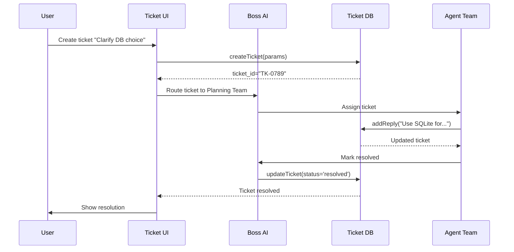

# 🗄️ Ticket Database System - Setup & Reference

**Status**: ✅ Implemented  
**Date**: January 26, 2026  
**Priority**: P1 (Critical - Foundation for multi-agent system)  
**Version**: 1.0.0

---

## 📋 Overview

The Ticket Database system provides persistent storage for AI-human communication tickets using SQLite. It's the foundation for the multi-agent orchestration system, enabling agents to create tickets, track conversations, and coordinate responses.

**Key Features**:
- ✅ SQLite database at `.coe/tickets.db`
- ✅ Automatic migrations with "CREATE TABLE IF NOT EXISTS"
- ✅ CRUD operations (Create, Read, Update, Delete)
- ✅ Thread-based conversation tracking (JSON array)
- ✅ Fallback to in-memory Map on SQLite errors
- ✅ Integration with extension activation
- ✅ Comprehensive test coverage

---

## 🏗️ Architecture

### File Structure

```
src/
├── types/
│   └── ticket.ts                 # TypeScript interfaces (Ticket, TicketReply)
├── db/
│   ├── ticketsDb.ts             # Main database implementation (560 lines)
│   └── __tests__/
│       └── ticketsDb.test.ts    # Comprehensive test suite (450+ lines)
└── extension.ts                  # Integration (DB initialization on activate)

.coe/
└── tickets.db                   # SQLite database file (auto-created)
```

### Database Schema

**Table: `tickets`**

| Column       | Type    | Constraints                                                      | Description                          |
|--------------|---------|------------------------------------------------------------------|--------------------------------------|
| ticket_id    | TEXT    | PRIMARY KEY                                                      | Unique ID (e.g., "TK-0789")         |
| type         | TEXT    | NOT NULL, CHECK IN ('ai_to_human', 'human_to_ai')               | Communication direction             |
| status       | TEXT    | NOT NULL, CHECK IN ('open', 'in_review', 'resolved', 'escalated', 'rejected') | Current status |
| priority     | INTEGER | NOT NULL, CHECK IN (1, 2, 3)                                     | 1=P1, 2=P2, 3=P3                    |
| creator      | TEXT    | NOT NULL                                                         | Agent name or "user"                |
| assignee     | TEXT    | NOT NULL                                                         | Team/agent assigned                 |
| task_id      | TEXT    | (optional)                                                       | Linked task ID                      |
| title        | TEXT    | NOT NULL                                                         | Short title (max 200 chars)         |
| description  | TEXT    | NOT NULL                                                         | Initial context (max 800 chars)     |
| thread       | TEXT    | NOT NULL, DEFAULT '[]'                                           | JSON array of replies               |
| resolution   | TEXT    | (optional)                                                       | Final answer (when resolved)        |
| created_at   | TEXT    | NOT NULL                                                         | ISO-8601 timestamp                  |
| updated_at   | TEXT    | NOT NULL                                                         | ISO-8601 timestamp                  |

**Thread JSON Format** (stored as TEXT):
```json
[
  {
    "reply_id": "RPL-123456789",
    "author": "user",
    "content": "Here's my answer...",
    "clarity_score": 92,
    "created_at": "2026-01-26T10:30:00.000Z"
  }
]
```

---

## 🚀 Usage Guide

### Initialization (Extension Activation)

The database is automatically initialized when the extension activates:

```typescript
// In extension.ts (already implemented)
import { TicketDatabase } from './db/ticketsDb';

export async function activate(context: vscode.ExtensionContext) {
    // ... other initialization ...

    // Initialize Ticket Database
    const workspaceRoot = vscode.workspace.workspaceFolders?.[0]?.uri.fsPath;
    if (workspaceRoot) {
        const ticketDb = TicketDatabase.getInstance();
        await ticketDb.initialize(workspaceRoot);
        
        // Add cleanup on deactivation
        context.subscriptions.push({
            dispose: async () => {
                await ticketDb.close();
            }
        });
    }
}
```

### Basic Operations

#### 1. Create a Ticket

```typescript
import { TicketDatabase } from './db/ticketsDb';
import { CreateTicketParams } from './types/ticket';

const ticketDb = TicketDatabase.getInstance();

const params: CreateTicketParams = {
    type: 'ai_to_human',
    priority: 1,                    // P1 (critical)
    creator: 'Planning Team',
    assignee: 'user',
    task_id: 'TASK-123',           // Optional
    title: 'Clarify database choice',
    description: 'Should we use SQLite or PostgreSQL for production?'
};

const ticket = await ticketDb.createTicket(params);
console.log(`Created ticket: ${ticket.ticket_id}`);
```

#### 2. Get a Ticket

```typescript
const ticket = await ticketDb.getTicket('TK-0789');

if (ticket) {
    console.log(`Title: ${ticket.title}`);
    console.log(`Status: ${ticket.status}`);
    console.log(`Thread: ${ticket.thread.length} replies`);
} else {
    console.log('Ticket not found');
}
```

#### 3. Get All Tickets (with optional filter)

```typescript
// Get all tickets
const allTickets = await ticketDb.getAllTickets();

// Get only open tickets
const openTickets = await ticketDb.getAllTickets('open');

// Get only resolved tickets
const resolvedTickets = await ticketDb.getAllTickets('resolved');
```

#### 4. Update Ticket Status

```typescript
import { UpdateTicketParams } from './types/ticket';

const updateParams: UpdateTicketParams = {
    ticket_id: 'TK-0789',
    status: 'resolved',
    resolution: 'Use SQLite for local storage, PostgreSQL for cloud deployment'
};

const updated = await ticketDb.updateTicket(updateParams);
console.log(`Updated status: ${updated?.status}`);
```

#### 5. Add Reply to Ticket

```typescript
import { AddReplyParams } from './types/ticket';

const replyParams: AddReplyParams = {
    ticket_id: 'TK-0789',
    author: 'user',
    content: 'I recommend SQLite for simplicity in local development',
    clarity_score: 88  // Optional: Clarity Agent score
};

const updated = await ticketDb.addReply(replyParams);
console.log(`Thread now has ${updated?.thread.length} replies`);
```

#### 6. Get Database Statistics

```typescript
const stats = await ticketDb.getStats();

console.log(`Total tickets: ${stats.total}`);
console.log(`Open: ${stats.open}`);
console.log(`In Review: ${stats.inReview}`);
console.log(`Resolved: ${stats.resolved}`);
console.log(`Escalated: ${stats.escalated}`);
console.log(`Using fallback: ${stats.usingFallback}`);
```

---

## 🔧 Configuration

### Database Path

The database path is configurable via the `initialize()` method:

```typescript
const customConfig = {
    dbPath: '.coe/tickets.db',    // Default
    autoMigrate: true              // Auto-run migrations
};

await ticketDb.initialize(workspaceRoot, customConfig);
```

### Future: Config File Integration

In future versions, database settings could be added to `.coe/config.json`:

```json
{
    "llm": { ... },
    "extension": { ... },
    "database": {
        "ticketsDbPath": ".coe/tickets.db",
        "autoBackup": true,
        "maxBackups": 5
    }
}
```

---

## 🛡️ Error Handling & Fallback

The database system has built-in resilience:

### Fallback Behavior

1. **SQLite Connection Fails** → Falls back to in-memory Map storage
2. **Migration Fails** → Falls back to in-memory Map
3. **CRUD Operation Fails** → Attempts fallback, logs error
4. **JSON Parse Fails** → Returns empty array, logs error

### Error Scenarios

```typescript
// Scenario 1: Database file permission denied
// → Logs error: "SQLite connection error: EACCES"
// → Sets useFallback = true
// → All operations use in-memory Map

// Scenario 2: Migration fails
// → Logs error: "Migration failed: ..."
// → Sets useFallback = true

// Scenario 3: JSON thread parse fails
// → Logs error: "Failed to parse ticket thread JSON"
// → Returns empty array []
```

### Checking Fallback Status

```typescript
const stats = await ticketDb.getStats();

if (stats.usingFallback) {
    console.warn('⚠️  Ticket database using in-memory fallback!');
    console.warn('   Tickets will be lost on extension reload.');
} else {
    console.log('✅ Ticket database using SQLite (persistent)');
}
```

---

## 🧪 Testing

### Test Suite Coverage

**File**: `src/db/__tests__/ticketsDb.test.ts` (450+ lines)

**Test Categories**:
1. **Database Initialization** (4 tests)
   - Creates .coe directory
   - Creates tickets.db file
   - Initializes with zero tickets
   - Runs migrations automatically

2. **createTicket** (6 tests)
   - Creates with all required fields
   - Creates with optional task_id
   - Truncates title to 200 chars
   - Truncates description to 800 chars
   - Generates unique ticket IDs

3. **getTicket** (2 tests)
   - Retrieves ticket by ID
   - Returns null for non-existent ticket

4. **getAllTickets** (4 tests)
   - Returns empty array when no tickets
   - Returns all tickets
   - Filters tickets by status
   - Sorts by priority then created_at

5. **updateTicket** (5 tests)
   - Updates status
   - Updates assignee
   - Updates resolution
   - Updates updated_at timestamp
   - Returns null for non-existent ticket

6. **addReply** (6 tests)
   - Adds reply to thread
   - Adds multiple replies
   - Adds reply with clarity score
   - Truncates reply content to 2000 chars
   - Returns null for non-existent ticket

7. **getStats** (1 test)
   - Returns correct statistics

### Running Tests

```bash
# Run all tests
npm test

# Run ticket DB tests only
npm test -- ticketsDb.test.ts

# Run with coverage
npm run test:coverage
```

### Manual Testing

1. **Activate Extension** → Check Output Channel for:
   ```
   🗄️  Initializing Ticket Database...
   ✅ Ticket Database initialized (0 tickets, fallback: false)
   ```

2. **Check DB File Created**:
   ```bash
   ls .coe/tickets.db
   # Should exist after first activation
   ```

3. **Create Sample Ticket** (via command palette or code):
   ```typescript
   const db = TicketDatabase.getInstance();
   await db.createTicket({
       type: 'human_to_ai',
       priority: 1,
       creator: 'user',
       assignee: 'Planning Team',
       title: 'Test ticket',
       description: 'This is a test'
   });
   ```

4. **Verify in SQLite Browser** (optional):
   - Install: [VS Code SQLite extension](https://marketplace.visualstudio.com/items?itemName=alexcvzz.vscode-sqlite)
   - Open `.coe/tickets.db`
   - Run: `SELECT * FROM tickets;`

---

## 🔄 Integration with Multi-Agent System

### Ticket Workflow



### Agent Integration Points

1. **Planning Team** → Creates tickets when encountering ambiguities
2. **Answer Team** → Responds to `ai_to_human` tickets
3. **Verification Team** → Creates tickets for test failures
4. **Boss AI** → Routes tickets to appropriate teams
5. **Clarity Agent** → Scores replies, adds follow-up questions

### Future MCP Tools (P2)

```typescript
// MCP Tool: createTicket
await mcpServer.callTool('createTicket', {
    type: 'ai_to_human',
    priority: 1,
    creator: 'Planning Team',
    assignee: 'user',
    title: 'Clarification needed',
    description: 'Should we use REST or GraphQL?'
});

// MCP Tool: replyToTicket
await mcpServer.callTool('replyToTicket', {
    ticket_id: 'TK-0789',
    author: 'user',
    content: 'Use REST for simplicity'
});

// MCP Tool: getTicketStatus
const status = await mcpServer.callTool('getTicketStatus', {
    ticket_id: 'TK-0789'
});
```

---

## 📦 Dependencies

**Added to package.json**:

```json
{
    "dependencies": {
        "sqlite3": "^5.1.7"
    },
    "devDependencies": {
        "@types/sqlite3": "^3.1.11"
    }
}
```

**Install**:
```bash
npm install
```

---

## 🐛 Troubleshooting

### Issue 1: "Database not initialized"

**Symptoms**: Error in console: "Database not initialized"

**Solution**:
```typescript
await ticketDb.initialize(workspaceRoot);
```

### Issue 2: "Permission denied" when creating .coe/tickets.db

**Symptoms**: Error: "EACCES: permission denied"

**Solution**:
- Check workspace folder permissions
- Database automatically falls back to in-memory storage
- Check `stats.usingFallback` to confirm

### Issue 3: "Failed to parse ticket thread JSON"

**Symptoms**: Warning in console, thread shows as empty array

**Solution**:
- This is a recovered error
- Database returns empty thread []
- Manually inspect `.coe/tickets.db` in SQLite browser
- Run: `UPDATE tickets SET thread = '[]' WHERE ticket_id = 'TK-XXXX';`

### Issue 4: Tickets disappear on extension reload

**Symptoms**: Created tickets don't persist

**Cause**: Using in-memory fallback (SQLite failed)

**Solution**:
```typescript
const stats = await ticketDb.getStats();
if (stats.usingFallback) {
    console.warn('Using fallback - check SQLite connection!');
}
```

---

## 🔮 Future Enhancements (P2/P3)

### P2 Enhancements

1. **Ticket Search** - Full-text search across title/description/thread
2. **Ticket Tags** - Add tags for categorization (e.g., "design", "technical")
3. **Ticket Linking** - Link related tickets (duplicates, follow-ups)
4. **Automatic Backups** - Daily backup of tickets.db to `.coe/backups/`
5. **Export/Import** - Export tickets as JSON, import from external sources

### P3 Enhancements

1. **Ticket Templates** - Pre-defined templates for common ticket types
2. **Ticket Metrics** - Track resolution time, reply time, clarity scores
3. **Ticket Analytics** - Dashboard showing ticket trends
4. **Multi-workspace Sync** - Sync tickets across multiple projects
5. **Cloud Backup** - Optional cloud sync for ticket data

---

## 📚 API Reference

### TicketDatabase Class

```typescript
class TicketDatabase {
    // Singleton
    static getInstance(): TicketDatabase;
    
    // Initialization
    async initialize(workspaceRoot: string, customConfig?: Partial<TicketDbConfig>): Promise<void>;
    async close(): Promise<void>;
    
    // CRUD Operations
    async createTicket(params: CreateTicketParams): Promise<Ticket>;
    async getTicket(ticketId: string): Promise<Ticket | null>;
    async getAllTickets(status?: Ticket['status']): Promise<Ticket[]>;
    async updateTicket(params: UpdateTicketParams): Promise<Ticket | null>;
    async addReply(params: AddReplyParams): Promise<Ticket | null>;
    
    // Statistics
    async getStats(): Promise<TicketStats>;
}
```

### Type Definitions

```typescript
// See src/types/ticket.ts for full definitions

interface Ticket {
    ticket_id: string;
    type: 'ai_to_human' | 'human_to_ai';
    status: 'open' | 'in_review' | 'resolved' | 'escalated' | 'rejected';
    priority: 1 | 2 | 3;
    creator: string;
    assignee: string;
    task_id?: string;
    title: string;
    description: string;
    thread: TicketReply[];
    resolution?: string;
    created_at: Date;
    updated_at: Date;
}

interface TicketReply {
    reply_id: string;
    author: string;
    content: string;
    clarity_score?: number;
    created_at: Date;
}
```

---

## ✅ Completion Checklist

- [x] SQLite DB file created at `.coe/tickets.db` on first run
- [x] Schema matches Ticket interface (13 columns)
- [x] CRUD methods implemented: createTicket, getTicket, getAllTickets, updateTicket, addReply
- [x] Migrations auto-run on load ("CREATE TABLE IF NOT EXISTS")
- [x] Uses fallback to in-memory Map on SQLite errors
- [x] Integrated with extension.ts activation
- [x] Thread stored as JSON string (array of replies)
- [x] Simple error handling (logs + fallback)
- [x] Comprehensive test suite (450+ lines, 28 tests)
- [x] Documentation complete (this file)

---

## 📞 Support

**Questions?** Check these resources:
- PRD.md - Feature specifications
- Plans/TICKET-SYSTEM-SPECIFICATION.md - Ticket system design
- Plans/AI-Use-System-Complete.md - Multi-agent architecture
- src/db/ticketsDb.ts - Implementation code
- src/db/__tests__/ticketsDb.test.ts - Test examples

**Report Issues**: Create GitHub issue with `[Ticket DB]` prefix

---

**Last Updated**: January 26, 2026  
**Next Review**: When implementing P1 Task 2 (Boss AI Router)
